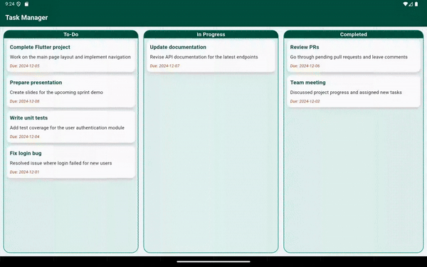
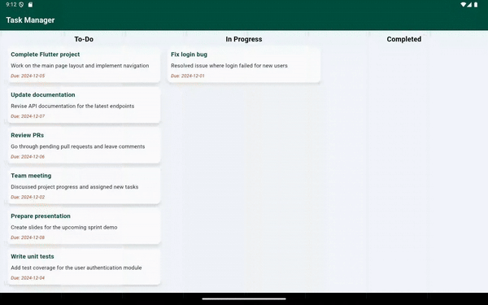

# draggable_multi_listview


**draggable_multi_listview** is a highly customizable Flutter package that allows developers to create multiple draggable and droppable lists with dynamic UI customization. The package supports features like drag-and-drop functionality, animated transitions, and UI decorations for a polished look.

---

## Features

- Create multiple lists with titles and items.
- Drag and drop items between lists with smooth animations.
- Customize spacing, title alignment, and UI decorations.
- Callback support for handling updates to lists after item movements.
- Flexible and responsive layout design.

---

## Demo

Here is a quick demo of the App   

### Ui decorated
 
   
<!-- ### Ui Not decorated
  -->
## Installation

Add the following to your `pubspec.yaml`:

```yaml
dependencies:
  draggable_multi_listview: 1.0.5
```
Then, run:
`
flutter pub get`  

Import the package into your Dart file:

` 'package:draggable_multi_listview/draggable_multi_listview.dart';
`


## Usage
### Example Code

Here’s an example of how to use the draggable_multi_listview widget in your app:

```import 'package:draggable_multi_listview/draggable_multi_listview.dart';
import 'package:flutter/material.dart';

void main() {
  runApp(DraggableMultiListViewExample());
}

/// A StatelessWidget representing the entire example UI for a
/// draggable_multi_listview task manager with three categories: To-Do, In Progress, Completed.
class DraggableMultiListViewExample extends StatelessWidget {
  DraggableMultiListViewExample({super.key});

  /// List of tasks in the "In Progress" state.
  /// Each task contains a title, description, and due date.
  final List<Map> inProgress = [
    {
      "title": "Write unit tests",
      "description": "Add test coverage for the user authentication module",
      "dueDate": "2024-12-04",
    },
    {
      "title": "Update documentation",
      "description": "Revise API documentation for the latest endpoints",
      "dueDate": "2024-12-07",
    },
  ];

  /// List of tasks in the "Completed" state.
  /// Each task contains a title, description, and due date.
  final List<Map> completed = [
    {
      "title": "Fix login bug",
      "description": "Resolved issue where login failed for new users",
      "dueDate": "2024-12-01",
    },
    {
      "title": "Team meeting",
      "description": "Discussed project progress and assigned new tasks",
      "dueDate": "2024-12-02",
    },
  ];

  /// List of tasks in the "To-Do" state.
  /// Each task contains a title, description, and due date.
  final List<Map> toDo = [
    {
      "title": "Complete Flutter project",
      "description": "Work on the main page layout and implement navigation",
      "dueDate": "2024-12-05",
    },
    {
      "title": "Review PRs",
      "description": "Go through pending pull requests and leave comments",
      "dueDate": "2024-12-06",
    },
    {
      "title": "Prepare presentation",
      "description": "Create slides for the upcoming sprint demo",
      "dueDate": "2024-12-08",
    },
  ];

  @override
  Widget build(BuildContext context) {
    return MaterialApp(
      debugShowCheckedModeBanner: false, // Disables the debug banner in the app
      title: 'Drag and Drop Example', // Sets the app's title
      theme: ThemeData.light().copyWith(
        scaffoldBackgroundColor:
            const Color(0xFFF3F8FB), // Background color of the entire app
        appBarTheme: const AppBarTheme(
          backgroundColor: Color(0xFF004D40), // AppBar's background color
          titleTextStyle: TextStyle(
            color: Colors.white,
            fontSize: 20,
            fontWeight: FontWeight.bold,
          ),
        ),
      ),
      home: Scaffold(
        appBar: AppBar(
          title: const Text('Task Manager'), // Title of the AppBar
        ),
        body: Padding(
          padding: const EdgeInsets.all(10), // Adds padding around the body
          child: MultiDragAndDrop(
            uiDecorated: false,
            disableTitle: false, // Enables the title for each title
            titleTextStyle: const TextStyle(
              color: Colors.black,
              fontSize: 18,
              fontWeight: FontWeight.bold,
            ), // Customizes the title text style
           // Enables UI decorations for the drag-and-drop lists
            verticalSpacing: 5, // Spacing between lists vertically
         
            titleAlignment: TitleAlignment.center, // Centers the titles
            items: [
              ListData(
                  title: 'To-Do',
                  items: toDo), // "To-Do" list with its respective tasks
              ListData(
                  title: 'In Progress',
                  items:
                      inProgress), // "In Progress" list with its respective tasks
              ListData(
                  title: 'Completed',
                  items:
                      completed), // "Completed" list with its respective tasks
            ],

            horizontalSpacingRatio: 0.02,

            /// [horizontalSpacingRatio] is the spacing ratio between items horizontally.Use this for handling the width of the items.
            itemBuilder: (item) => Container(
              decoration: BoxDecoration(
                color: Colors.white, // Sets item background color
                borderRadius:
                    BorderRadius.circular(12), // Adds rounded corners to items
                boxShadow: [
                  BoxShadow(
                    color: Colors.grey.withOpacity(0.4),
                    blurRadius: 6,
                    offset: const Offset(0, 4),
                  ),
                ],
              ),
              child: Padding(
                padding: const EdgeInsets.all(
                    10.0), // Padding inside the draggable task items
                child: Column(
                  crossAxisAlignment: CrossAxisAlignment.start,
                  children: [
                    Text(
                      item['title']
                          .toString(), // Displays the title of the item
                      style: const TextStyle(
                        fontSize: 16,
                        fontWeight: FontWeight.bold,
                        color: Color(0xFF004D40),
                      ),
                    ),
                    const SizedBox(height: 8),
                    Text(
                      item['description']
                          .toString(), // Displays the description of the item
                      style: const TextStyle(
                        fontSize: 14,
                        color: Colors.black87,
                      ),
                    ),
                    const SizedBox(height: 8),
                    Text(
                      "Due: ${item['dueDate']}", // Displays the due date
                      style: const TextStyle(
                        fontSize: 12,
                        fontStyle: FontStyle.italic,
                        color: Color(0xFFBF360C),
                      ),
                    ),
                  ],
                ),
              ),
            ),
            onListsChanged:
                (updatedLists, sourceIndex, targetIndex, movedItem) {},
          ),
        ),
      ),
    );
  }
} 
```

## Usage Guidelines
### Assertions:

* horizontalSpacingRatio must be within the range 0.01 and 0.09.

* The initial items list must not be empty.

* If uiDecorated is enabled:
  paddingForDecoratedUi, titleTextStyle, and decorationForDecoratedUi must be provided.

* If uiDecorated is disabled:
paddingForDecoratedUi and decorationForDecoratedUi must not be provided.

 